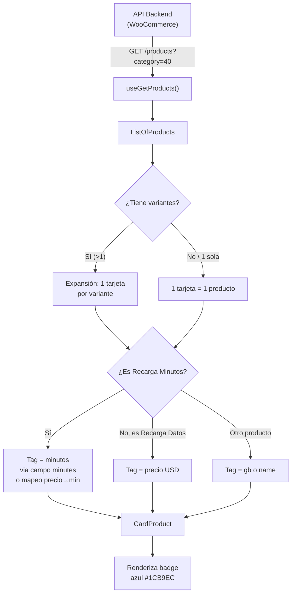

# Documentación: Etiquetas (Tags) de Recargas Minutos / Datos

Guía para el equipo de app sobre cómo el frontend web maneja las etiquetas (badges/tags) que se muestran en las tarjetas de productos de **Recarga Minutos** y **Recarga Datos**.

---

## 1. Productos Relevantes (IDs del Backend)

```
ENCRYPTED_SIM_PRODUCT_IDS = {
  DATA:     443,    // Recarga Datos   (variantes: $25, $50, $100, $150, $250, $500)
  MINUTES:  446,    // Recarga Minutos (variantes: $200, $500, $1000)
  ESIM:     449,    // eSIM (precio único: $12)
  ESIM_DATA: 59835, // eSIM + Recarga Datos (variantes: $32.5 … $507.5)
  SIM_FISICA_TIM: 448,
  SIM_FISICA_ENCRYPTED: 508,
}
```

> [!IMPORTANT]
> - Estos IDs son del catálogo WooCommerce del backend.
> - Todos pertenecen a **categoría 40** (SIMs).

---

## 2. Tipo `ProductVariant` (estructura de variante)

Cada producto puede tener un array `variants` con esta estructura:

```typescript
interface ProductVariant {
  id: number;
  name?: string;
  gb?: string;          // Ej: "5 GB"
  cost?: number;        // Precio (TIM)
  price?: number;       // Precio (Encriptados)
  minutes?: number;     // Minutos incluidos (si aplica)
  days?: number;
  scope?: {
    type: string;       // "country" | "region"
    code: string;       // "CO", "MX", "LATAM", etc.
  };
  // ...otros campos
}
```

---

## 3. Identificación de Producto "Recarga Minutos" (multi-idioma)

Se detecta un producto como "Recarga Minutos" mediante **SKU** y **nombre**:

```typescript
// Por SKU
const isMinutesSku =
  sku.includes("minutes") ||
  sku.includes("minute") ||
  sku === "minutes-sim-encriptados";

// Por nombre (soporta ES, EN, FR, IT, PT)
const isMinutosProduct =
  isMinutesSku ||
  /minut(os?|es?|i)/i.test(nombre) ||          // "Minutos", "Minutes", "Minuti"
  /(recarga|recharge|ricarica)\s*minut/i.test(nombre); // "Recarga Minutos", etc.
```

### Filtro de servicio (regex patterns)

Cuando el usuario filtra por servicio `"minuterecharge"`, se aplican estos patrones:

```typescript
minuterecharge: [
  /^(minutos?\s+)?(recarga|recharge|ricarica)/i,
  /^(recharge|ricarica)\s+minutes?/i,
  /^recarga\s+minut/i,
]
```

---

## 4. Cómo se Genera la Etiqueta (Tag) de Minutos

### 4.1 Productos Encriptados SIN Variante Expandida

Usa un **mapeo de precio → minutos** hardcodeado:

```typescript
const priceToMinutesMap: Record<number, number> = {
  200:  100,   // $200 → "100 min"
  500:  250,   // $500 → "250 min"
  1000: 500,   // $1000 → "500 min"
};
```

- Se usa `product.price` o `product.sale_price`.
- Si no coincide con el mapeo, busca en el nombre con regex: `/(\\d+)\\s*min/i`.
- Formato final: `"{minutos} min"` (localizado con `t("minuteAbbr")`).

### 4.2 Productos Encriptados CON Variante Expandida

Cuando el producto tiene múltiples variantes, se crea **una tarjeta por variante**. El tag se genera así:

```typescript
// 1. Buscar campo `minutes` de la variante
let minutesValue = selectedVar.minutes;

// 2. Fallback: mapeo precio → minutos
if (!minutesValue && selectedVar.price) {
  const priceToMinutesMap = { 200: 100, 500: 250, 1000: 500 };
  minutesValue = priceToMinutesMap[Number(selectedVar.price)];
}

// 3. Si se encontró un valor, generar tag
if (minutesValue) {
  tag = `${minutesValue} min`;  // Ej: "100 min", "250 min", "500 min"
}
```

> [!NOTE]
> La expansión de variantes crea una tarjeta visual separada para cada variante del producto. Si "Recarga Minutos" (ID=446) tiene 3 variantes ($200, $500, $1000), se muestran **3 tarjetas**, cada una con su tag: `100 min`, `250 min`, `500 min`.

---

## 5. Recarga Datos (para referencia)

Para **Recarga Datos** y **eSIM + Datos**, el tag muestra el **precio en USD**:

```typescript
// Tag = precio de la variante en USD
const price = Number(selectedVar.price) || Number(selectedVar.cost);
tag = `${price} USD`;  // Ej: "250 USD", "500 USD"
```

---

## 6. Renderizado Visual del Tag (CardProduct)

El tag se renderiza como un badge circular (pill) junto al título:

```
┌───────────────────────────────────────┐
│ [imagen del producto]                  │
│                                       │
│  Recarga Minutos         ┌──────────┐ │
│                          │ 250 min  │ │  ← Badge azul (categoría 40)
│                          └──────────┘ │
│  ✓ Llamadas irrastreables             │
│  ✓ Filtros de voz                     │
│  ✓ Número sustituto                   │
│                                       │
│  500$                                 │
│  [Comprar]    Más información         │
└───────────────────────────────────────┘
```

### Estilos del badge

| Categoría | Color fondo  | Color texto |
|-----------|-------------|-------------|
| 40 (SIMs) | `#1CB9EC` (azul) | `#010101` (negro) |
| Otras     | `#DEDEDE` (gris) | `#010101` (negro) |

### Tamaños

| Breakpoint | Height | Font size | Padding horizontal |
|------------|--------|-----------|-------------------|
| Mobile     | 16px   | 9px       | 8px               |
| Desktop    | 20px   | 11px      | 12px              |

---

## 7. Flujo de Datos Completo



---

## 8. Props Relevantes que Recibe CardProduct

```typescript
interface CardSimProps {
  id: number;                    // ID del producto
  headerTitle: string;           // Nombre: "Recarga Minutos"
  priceRange: string;            // Precio: "500$"
  badges?: {
    country?: {
      label: string;             // "Colombia"
      code?: string;             // "co"
      flagUrl?: string;          // URL bandera
    };
    tag?: string;                // "250 min" ← LA ETIQUETA
  };
  provider?: string;             // "encrypted" | "tim"
  typeProduct?: string;
  variantId?: number;            // ID de la variante seleccionada
  variants?: any[];              // Todas las variantes del producto
  onSale?: boolean;
  regularPrice?: number;
  iconUrl?: string;
}
```

---

## 9. Interacción con el Modal de Pago

Cuando el usuario clickea **"Comprar"**, se pasan estos datos al modal:

```typescript
openModal({
  productid: id.toString(),      // "446"
  initialPrice: numericPrice,    // precio de la variante
  variantId: variantId,          // ID de variante seleccionada
  variants: variants,            // todas las variantes
  initialGb: badges?.tag,        // "250 min" (el mismo tag)
  provider: provider,
  typeProduct: typeProduct,
  iconUrl: iconUrl,
});
```

El modal `ModalRecharge` usa `variantId` y/o `initialPrice` para pre-seleccionar la variante correcta.

---

## 10. Resumen para la App

| Concepto | Valor |
|----------|-------|
| **Product ID** | 446 |
| **Category ID** | 40 |
| **Variantes** | 3 ($200, $500, $1000) |
| **Mapeo precio→minutos** | `200→100`, `500→250`, `1000→500` |
| **Formato tag** | `"{minutos} min"` |
| **Color badge** | Azul `#1CB9EC` |
| **Campo variante** para minutos | `variant.minutes` (o fallback al mapeo) |
| **Detección multi-idioma** | SKU contiene "minutes" O nombre hace match con `/minut(os?\|es?\|i)/i` |
